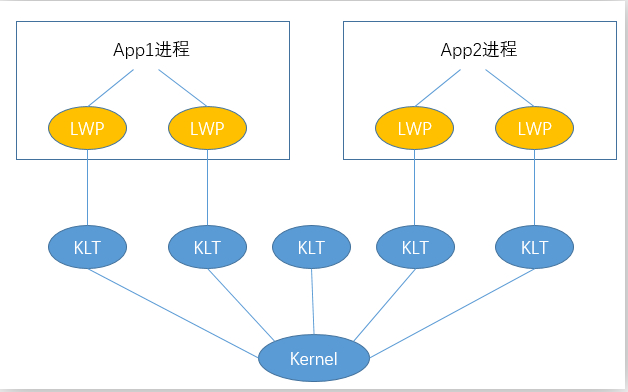
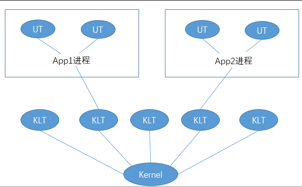
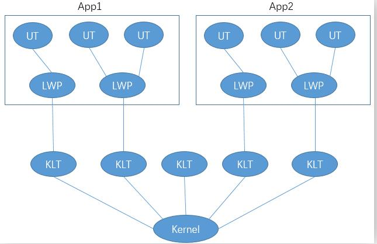

# JVM-Java内存模型与线程

### 一，主内存与工作内存

+ 主内存

  所有变量都存储在主内存中。

+ 工作内存

  线程的工作内存保存了被该线程使用到的变量的主内存副本拷贝，线程对变量的所有操作都在工作内存中完成，线程不能直接读写主内存中的变量。

+ Java内存模型

  Java线程--->工作内存--->sava和load操作--->主内存

+ 内存间交互操作

  + lock:作用于主内存的变量，它把一个变量标识为一条线程独占的状态。
  + unlock：作用域主内存的变量，它把一个处于锁定状态的变量释放出来，释放后的变量才可以被其他线程锁定。
  + read：作用于主内存的变量，它把一个变量的值从主内存传输到工作内存当中。
  + load：作用于工作内存的变量，它把read操作从主内存中得到的变量值放入工作内存的变量副本当中。
  + srore：作用于工作内存中的变量，它把工作内存中的一个变量的值传送到主存中，以便随后的write操作使用。
  + write：作用于主内存的变量，它把store操作从工作内存中得到的变量的值写入主内存当中。

+ volatile关键字

  - 该关键字保证了指令的有序性，可见性，但是不能保证操作的原子性。因此在使用在关键字的时候，一定要保证操作是原子操作才可以保证数据的线程安全性。
  - 保证可见性的原理：在有volatile修饰的地方，当变量发生变化的时候，变化完之后会执行一个lock操作，这个操作类似于Java内存模型当中的store和write操作。所以通过这样的一个操作，可以使得volatile修饰的变量当发生变化的时候，也会被其他线程所看到。
  - 禁止指令重排序：当执行lock操作的时候，意味着所有之前的操作都已经是执行完成。
  - lock操作本质上是插入了一个内存屏障，来保证一致性(指令重排序保证了在后面的指令不能排到内存屏障之前的位置)。

+ 三大特性

  - 原子性

    一个操作或者多个操作，这些操作要么全部执行，要么全部不执行。

  - 可见性

    当一个线程修改了一个共享变量的值，那么该值的最新值可以被其他的线程所知道。

  - 有序性

    如果在本地线程内观察，所有操作都是有序的，如果从一个线程看另一个线程的话，所有的操作都是无序的。

+ happen-before原则：这些先行先发生关系无需同步器协助就已经存在，可以在编码中直接使用。

  + 程序次序规则：在一个线程内，按照代码顺序，书写在前面的操作先于发生于书写在后面的操作。
  + 管程锁定规则：一个unlock操作先性发生于后面对同一个锁的lock操作。
  + volatile变量规则：对一个volatile变量的写操作先行发生于后面对这个变量的读操作。后面是指的时间上的顺序。
  + 线程启动规则：线程的start()方法先行于该线程的每一个动作。
  + 线程终止规则：线程中所有操作都先行于终止检测。
  + 线程中断规则：对线程interrupt()方法的调用先行发生与被中断线程的代码检测中中断事件的发生。
  + 对象终结规则：一个对象的初始化先行发生于它的finalize()方法的开始。
  + 传递性：如果操作A先行与操作B，操作B先行于操作C，那么操作A就先性于操作C。

  ### 二，Java线程的实现

+ 基于LWP（轻量级进程，实现是建立在内核之上的）也就是我们通常所说的线程。

​	

  理解：进程由多个线程组成，每个线程对应一个内核线程（KLT），CPU通过对KLT的调度来实现对线程的管理。

  局限性：首先，由于是基于内核线程实现的，所以各种线程操作，如创建，析构，同步，都需要进行系统的调用。而系统的调用代价相对较高，需要在用户态和内核态来回切换。其次，每个轻量级进程都需要一个内核进程的支持，因此轻量级进程要消耗一定的内核资源。

+ 使用用户线程实现

​	

  理解：一个进程与一个内核线程相对应，程序自己实现用户线程，而不是调用轻量级进程来实现。线程的调度不需要LWP，由自己完成。但是由于是脱离了OS的管理，需要用户自己去实现线程什么时候挂起，阻塞的时候如何处理等问题。

+ 前两种结合起来

  理解:

  如图所示，Java线程还是使用用户线程库的线程实现，这样有两个好处：

  大部分操作不需要调用OS，自己就能完成

  用户线程库的线程数不像KLT有严格的限制，基本上够应用程序使用

  而LWP还是要用的，不过他只负责线程管理的部分（如线程的创建、销毁、调度）。

  这种设计的巧妙之处就是利用OS提供的LWP作为用户态和内核态的桥梁，应用程序自己能够解决的部分就尽量在用户态完成，而确实需要切换到内核态的操作再委托LWP调用OS。

+ 线程的状态
  + 新建
  + 运行
  + 无限期等待
  + 阻塞
  + 结束